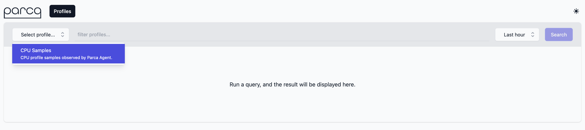
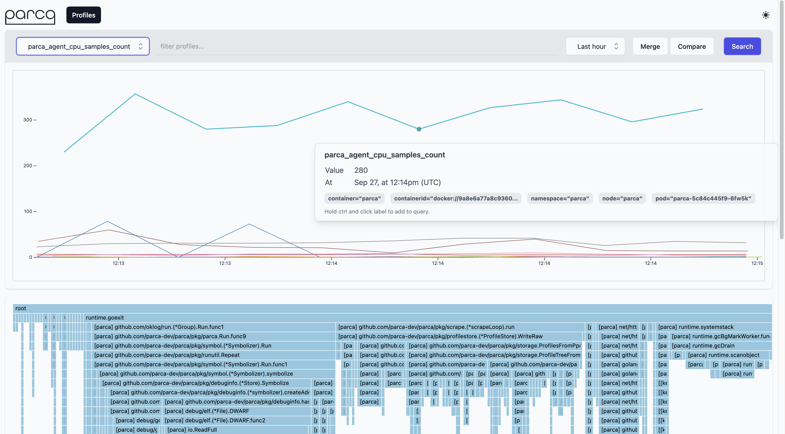
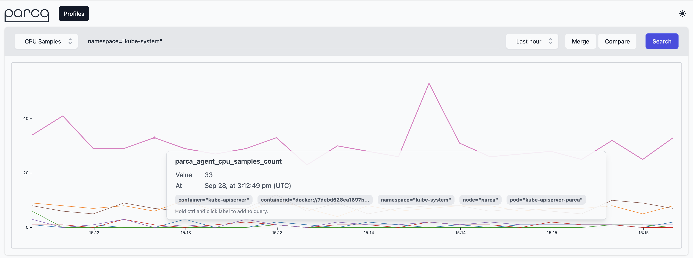
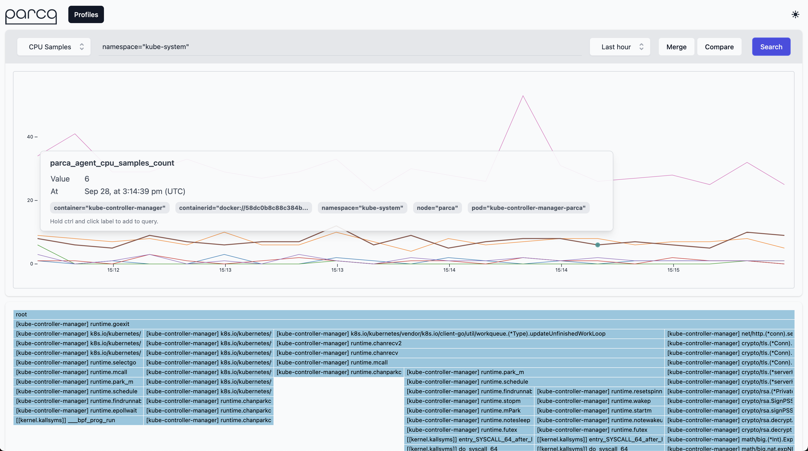

[Let's visit Parca Server Dashboard](https://[[HOST_SUBDOMAIN]]-7070-[[KATACODA_HOST]].environments.katacoda.com/)

You should shortly see the `Select profile...` dropdown menu populate with the profiles that Parca is retrieving from itself and receiving from the Agent.

> Parca supports any pprof formatted profile, but here we are demonstrating Parca Agent's automatic profiling with zero-instrumentation, which currently only supports CPU profiling.

Selecting `CPU Samples` as profile type and clicking the `Search` button will retrieve the profiles from Parca Agent for the time selection (default Last Hour).

This should result in a time series based on the profile that is interactable.
Clicking anywhere on the line graph should then bring up an icicle graph for the profile that you've selected.

You can then interact with the icicle graph to better understand how Parca is behaving.

> One of the cool features of Parca Agent is by default it discovers all the containers run on the nodes that it's been deployed.
So out of the box you should be seeing all the system containers running on the system.
If you go to query bar and enter `namespace="kube-system"` you can focus on them.

And you can click the samples on the graph to focus on the individual profiles.

