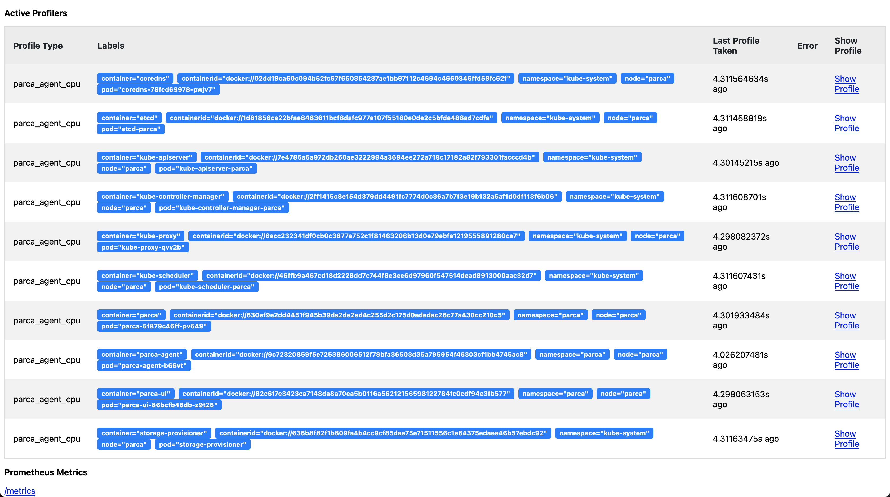

And fetch the latest Parca Agent version:

```
PARCA_AGENT_VERSION=`curl -s https://api.github.com/repos/parca-dev/parca-agent/releases/latest | grep -oP '"tag_name": "\K(.*)(?=")'`
```{{execute}}

To provision the Parca Agent as a `DaemonSet`:

```
oc apply -f https://github.com/parca-dev/parca-agent/releases/download/$PARCA_AGENT_VERSION/openshift-manifest.yaml
```{{execute}}

You can verify by selecting pods if everything runs as expected:

```
oc get pods -n parca
```{{execute}}

When you see it's ready, you can continue.

Now let's setup a port-forward using the default port `7071`.

```
oc -n parca port-forward --address=0.0.0.0 `oc -n parca get pod -lapp.kubernetes.io/name=parca-agent -ojsonpath="{.items[0].metadata.name}"`:7071 > /dev/null 2>&1 &
```{{execute}}

Now we can view the active profilers by visiting `http://localhost:7071`:

[Go to Parca Agent Dashboard](https://[[HOST_SUBDOMAIN]]-7071-[[KATACODA_HOST]].environments.katacoda.com/)

This is similar to what you should be seeing:



## Configuring Parca Agent to send data

To continuously send every profile collected to a Parca server the configure the `--store-address` and the potential credentials needed.

For example, to send data to a Parca server in the `parca` namespace we have set the following: `--store-address=parca.parca.svc:7070`.

This has already been set up for our current setup in the previously applied manifests.

```yaml
containers:
    - args:
    - /bin/parca-agent
    - --log-level=info
    - --node=$(NODE_NAME)
    - --kubernetes
    - --store-address=parca.parca.svc.cluster.local:7070
    - --insecure
    - --insecure-skip-verify
    - --temp-dir=/tmp
```

> TIP: You can use `--insecure` and `--insecure-skip-verify` for simpler setups.

```shell
--insecure                           Send gRPC requests via plaintext instead of TLS.
--insecure-skip-verify               Skip TLS certificate verification.
```

Once Parca and Parca Agent are both running, you can navigate to the web interface on the browser. Let's do that.
