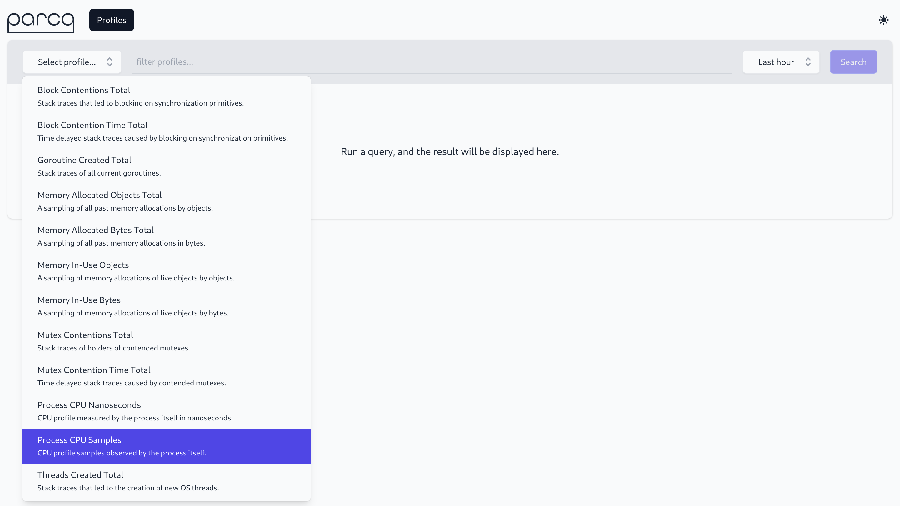
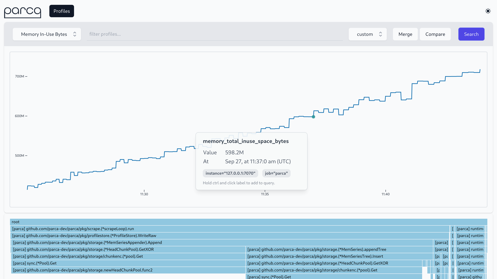
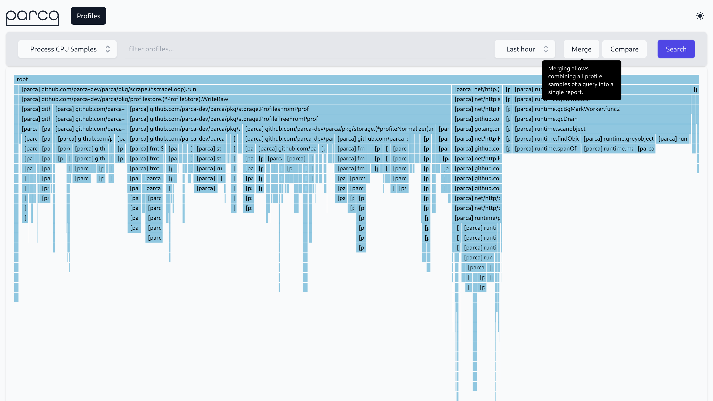
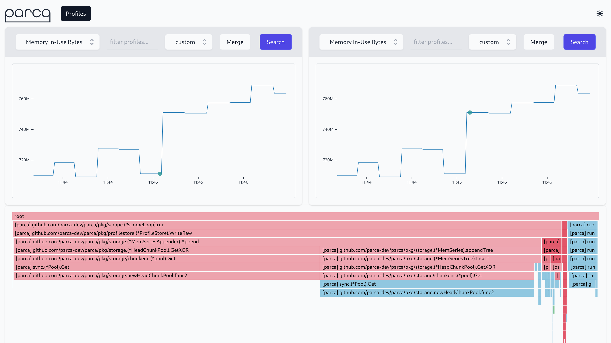

[Let's visit Parca Server Dashboard](https://[[HOST_SUBDOMAIN]]-7070-[[KATACODA_HOST]].environments.katacoda.com/)

Parca features a simple label-selector based query language, which is used to select the dimensions to be included in a query. The Parca web UI implements autocompletion to make this as easy as possible for newcomers.

## Single point in time

The simplest possible example could be to query for a single profile taken as a certain point in time. To do so, we first select a type of profile we are interested in through the profile-type dropdown.

> For well-known profile-types Parca displays a description of the respective profile type.

Once a profile type is selected the "Search" button can be pressed or hitting "Enter" triggers a search as well. This pulls up the aggregated metrics view, which makes it easier to identify a point in time at which a profile may be interesting. A slick on the graph pulls up the respective profile.

## Merge over time

Merging of profiles is particularly useful to get an understanding of how a process behaved in aggregate over time. As opposed to a single point in time, merging over time represents how the process behaved in aggregate over time, which is useful to understand what code to optimize for maximum gain.

To merge profiles using Parca, select a profile type, and the time range that is interesting to view in aggregate, then hit the "Merge" button.

## Compare

Comparing allows specifying two queries to compare to each other. This could be two single point in time queries, two merge queries or one of each. Comparing can be useful for various use cases, but they can be summarized as "understanding change". Whether it is comparing two points in time, comparing two versions of a software, or any other dimensions such as datacenter or region comparisons.

Comparisons render the visualization as a differential flamegraph/iciclegraph, where the sizes refer to the second selection, and the color describes the change (the darker the red, the worse it got, the darker the green, the better it got).

